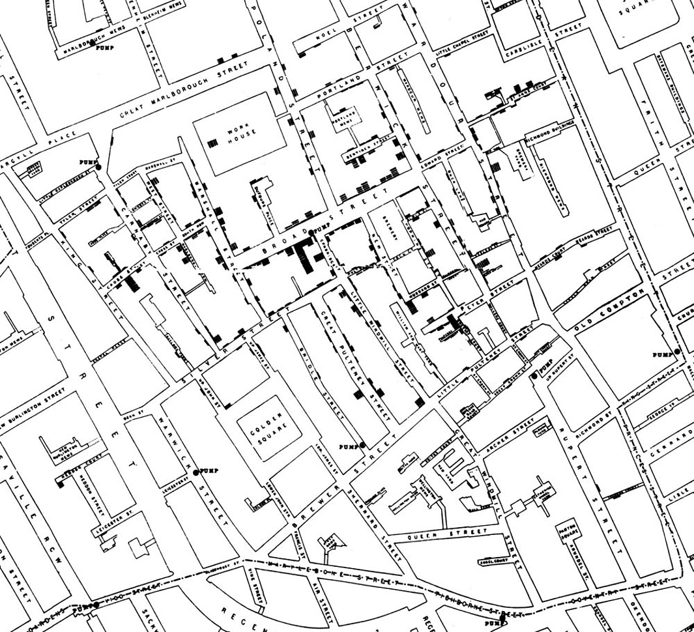

# Causality and Experiments

Does the death penalty have a deterrent effect?
Is chocolate good for you?
What causes breast cancer?

- All of these questions attempt to assign a **cause** to an **effect**. 
- A **careful examination of data** can help shed light on questions like these?

## Concepts involved in establishing causality

- Observation: is key to good science.
- In observational study scientists make conclusions based on observed data.
- In data science, many studies involve:
	1. **observations on a group of individuals(people)**, 
	2. a factor of interest called a **treatment**, and
	3. an **outcome** measured on each individual.

**Example:** In a study of whether chocolate is good for health
1. the individuals would be people
2. the treatment would be eating chocolate, and
3. the outcome might be a measure of heart disease.

- The **fundamental question** is whether the **treatment** has an effect on the **outcome**.
- **Any relation** between the **treatment** and the **outcome** is called **association**.
- **If** the **treatment causes the outcome** to occur, then the association is **causal**.
- The **establishment of causality** takes place in **two stages**, 1. An association is observed, 2. A more careful analysis leads to a decision about causality.

## Observation and Visualization: John Snow and the Broad Street Pump

- One of the most powerful examples of astute observation eventually leading to establishment of causality dates back more than 150 years. 
- 1850s, London, world's wealthiest city, but many of its people were desperately poor.

- Charles Dickens, a famous novelist wrote about their plight.

- Disease was rife in the poorer parts of the city.

- The leading theory was that Miasmas were the main culprit. 

- Miasmas manifested themselves as bad smells, and were thought to be invisible poisonous particles arising out of decaying matter.

- Those who could afford to held sweet-smelling things to their noses.

- John Snow, a doctor, had been following the devastating waves of cholera that hit England from time to time.

- The disease arrived suddenly and was almost immediately deadly: people died within a day or two of contracting it, total death toll in a single wave could reach tens of thousands.

- Snow was skeptical of the miasma theory. 

- **Snow had noticed** that while entire households were wiped out by cholera, the people in neighboring houses sometimes remained completely unaffected.

- As they were breathing the same air as their neighbors, there was no compelling association between bad smells and the incidence of cholera.

- **Snow had also noticed** that the onset of the disease almost always involved vomiting and diarrhea.  

- He therefore believed that the infection was carried by something people ate or drank, not by the air that they breathed.

- At the end of August 1854, cholera struck in the overcrowded Soho district of London.
- As the deaths mounted, Snow recorded them diligently, using a method that went on to become standard in the study of how diseases spread: **he drew a map**. 
- On a street map of the district, he recorded the location of each death.

- Each black bar represents one death.
- Black discs mark the locations of water pumps.
- The map displays a striking revelation- **the deaths are roughly clustered around the broad street pump**.

### Snow investigated apparent anomalies

- There were **deaths in houses that were nearer the Rupert Street pump** than the Broad Street pump.
- Rupert Street pump was less convenient to get to because of dead ends and the layout of the streets.
- The residents in those houses used the Broad Street pump instead.

- **No deaths in two blocks just east of the pump**. Workers drank beer or water from a separate well.

- **Scattered deaths in houses several blocks away from Broad Street pump**. Those were children who drank from the Broad Street pump on their way to school.

- **The final piece of evidence in support of Snow's theory was provided be two isolated deaths** in leafy and genteel Hampstead area, quite far from Soho.

- Snow was puzzled by these until he learned that the deceased who had water delivered to them from Broad Street because they liked the taste.

- Later it was discovered that a cesspit that was just a few feet away from the well of the Broad Street pump had been leaking into the well. 

- Thus the pump water was contaminated by sewage from the houses of cholera victims.

- Snow used his map to convince local authorities to remove the handle of the Broad Street pump. 

- Snow's map is one of the earliest and most powerful uses of data visualization. 
- Disease maps of various kinds are now a standard tool for tracking epidemics. 

## Towards Causality

- Though the map gave Snow a strong indication that the cleanliness of the water supply was the key to controlling cholera, he was still a long way from the convincing scientific argument that contaminated waster was causing the spread of the disease.
- To make a more compelling case, he had to use the method of **comparison**.

- Scientists use comparison to identify an association between a treatment and an outcome.
- They compare the outcomes of a group of individuals who got the treatment (the treatment group) to the outcomes of a group who did not(the control group).

- e.g. researchers today might compare the average murder rate in states that have the death penalty with the average murder rate in states that don't.

