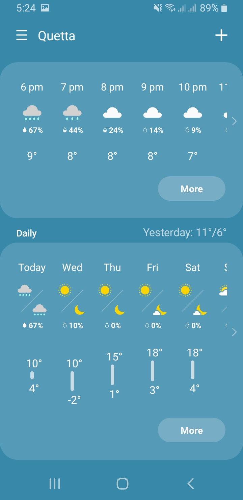
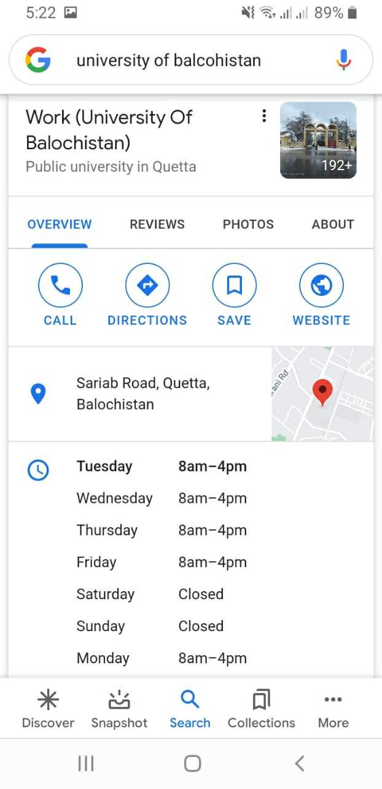

# Who imagined Data Science(DS) first?
\begin{columns}[c]
	\begin{column}{0.3\textwidth}
		\includegraphics[width=4.0cm]{images/james_gray.jpg}
	\end{column}
	\begin{column}{0.7\textwidth}
		\begin{itemize}
			\item Turing Award Winner James Nicholas Gray
			\item Imagined DS as 4rth paradigm of science
		\end{itemize}
	\end{column}
\end{columns}

# What is Data Science?
 
 

# What is Data Science?

> - You have \alert{already experienced} it in \alert{several forms}
> - It has been \alert{behind resolving} some of our \alert{common daily tasks for several years}
> - \alert{Most} of the \alert{scientific methods used} in DS are \alert{not new}
> - \alert{Statistics} an old science Simon Laplace 1749 and Thomas Bayes (1701)
> - \alert{Machine learning} relatively new but considered well established
> - \alert{Computer Science} changed lives several decades ago

# Why Data Science is seen as a novel trend?
> - \alert{Datafication}: disruptive change in our society caused by the evolution of technology
> + personal level: list of books, films, food, physical activity, purchases
> + business level: web activity, network activity, machinery signals
> - \alert{democratization of data analysis}
> + large companies Google, Yahoo, IBM, SAS were only players when data science had no name
> + today the gap between companies and people is shrinking.
> - access to cloud computing allows any individual to analyze huge amounts of data in short periods of time.
>	- Analytical knowledge is free 
> + Crucial algorithms needed can be found
> + Open source development is the norm

# Data Science defined
 A methodology by which actionable insights can be inferred from data.

# Objective of data science
- production of beliefs informed by data to be used as the basis of decision making
- In absence of data, beliefs are uninformed and decisions are based on best practice or intuition.

# Data Science and 4 strategies
- DS allow us to adopt 4 different strategies to explore the world using data.
1. Probing reality
2. Pattern discovery
3. Predicting future events
4. Understanding people and the world.

# Probing Reality
- Data can be gathered by
	i) passive methods
	ii) active methods: response of the world to our actions
- Analysis of these responses can be extremely valuable. 
  - e.g. what is the best button size and color? best answer found by probing the world.

# Pattern discovery
- Datafied problems can be analyzed automatically to discover useful patterns.
	- e.g. user profiles an ingredient in programmatic advertising or digital marketing.

# Predicting future events
- variety of statistical techniques that analyze current and historical facts to make predictions about future events.

# Understanding people and the world
- large companies and governments are investing considerable amounts of money in research areas e.g.
  + understanding natural language
	- computer vision
	- psychology
	- neuroscience

# Toolboxes for Data Scientists
- [Python](https://www.python.org/)
- [R](https://www.r-project.org/)
- [Matlab](https://www.mathworks.com/products/matlab.html) / [Octave](https://www.gnu.org/software/octave/index)

# Fundamental Python Libraries for Data Scientists

1. Numeric and Scientific Computation: NumPy and SciPy
2. Machine Learning in Python: SCIKIT-Learn
3. Python Data Analysis: PANDAS

# Data Science Ecosystem Installation
- All in one bundle [Anaconda](https://www.anaconda.com/products/individual) 

# Practical session

# How to learn more 
- plenty of resource available online for free
	+ [kaggle](https://www.kaggle.com/)
	- [datacamp](https://learn.datacamp.com/)
	- [R swirl](https://swirlstats.com/)
- [my github repo](https://github.com/beyond2013/datascience)
